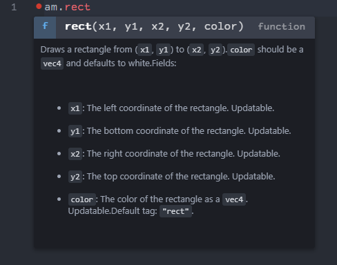
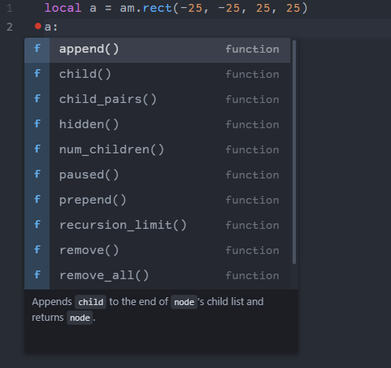

Builds a .luacompleterc and a .luacheckrc by using Amulet (must be in PATH).

It is *very* quick and dirty but in editors that allow it, it provides some level of autocompletion for types, like so:

Basic completion:

Type based completion:

Missing:
- Swizzle fields
- mat2, mat3 and mat4 returnType
- quat returnType
- differentiating between globals and read_only
